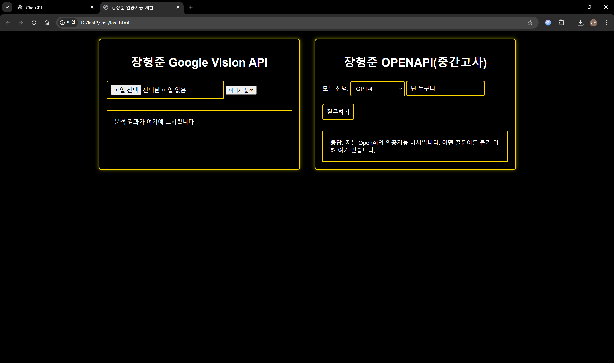

# capstone1
# 장형준 Google Vision 및 OpenAI API 프로젝트

## 사용 언어
- HTML
- JavaScript
- CSS

## 프로젝트 설명
이 프로젝트는 Google Vision API와 OpenAI의 ChatGPT API를 사용하여 이미지 분석과 질의응답을 수행하는 웹 애플리케이션입니다.

### 주요 기능
1. **Google Vision API 이미지 분석**
   - 사용자가 업로드한 이미지를 분석하여 얼굴을 감지하고 감정 상태를 파악하여 결과를 화면에 표시합니다.

2. **OpenAI ChatGPT API 질의응답**
   - 사용자가 입력한 질문을 OpenAI ChatGPT API에 전송하여 응답을 화면에 출력합니다.

## 파일 설명

- **last.html**  
  애플리케이션의 기본 구조와 UI를 정의하는 HTML 파일입니다. Google Vision API와 OpenAI API의 UI 요소가 포함되어 있습니다.

- **last.js**  
  Google Vision API 및 OpenAI ChatGPT API와의 상호작용을 처리하는 JavaScript 파일입니다. 이미지 업로드, 분석 요청, 질의응답 요청 기능이 구현되어 있습니다.

- **test.png**  
  테스트용 이미지 파일입니다. Google Vision API의 분석 대상이 될 수 있습니다.

## 사용법

1. **환경 설정**
   - Google Vision API와 OpenAI API의 키를 발급받아 `last.js` 파일의 `OPENAPI_KEY`와 `VISION_API_KEY`에 할당합니다.

2. **이미지 업로드 및 분석**
   - `last.html` 파일을 브라우저에서 열고, "파일 선택" 버튼을 클릭하여 `test.png` 파일을 업로드합니다.
   - "이미지 분석" 버튼을 눌러 분석을 시작합니다.
   - 분석 결과가 "분석 결과가 여기에 표시됩니다." 영역에 표시됩니다.

3. **질문하기**
   - 오른쪽의 질문 입력란에 질문을 입력하고 "질문하기" 버튼을 누릅니다.
   - ChatGPT API의 응답이 출력 영역에 표시됩니다.

## 설치 및 실행

1. 이 프로젝트를 로컬에 복사합니다.
2. `last.html` 파일을 브라우저에서 엽니다.

---

### 코드 예시

#### last.html

```html
<!DOCTYPE html>
<html lang="ko">
<head>
    <!-- 생략된 코드 -->
</head>
<body>
    <div class="container">
        <!-- Google Vision API UI 영역 -->
        <div class="section">
            <h1>장형준 Google Vision API</h1>
            <input type="file" onchange="uploadFiles(this.files)">
            <input type="button" onclick="analyze()" value="이미지 분석">
            
            <div id="resultArea">분석 결과가 여기에 표시됩니다.</div>
        </div>
        <!-- OpenAI ChatGPT UI 영역 -->
        <div class="section">
            <h1>장형준 OPENAPI(중간고사)</h1>
            <label for="modelSelect">모델 선택:</label>
            <select id="modelSelect">
                <option value="gpt-4">GPT-4</option>
                <option value="gpt-3.5-turbo">GPT-3.5 Turbo</option>
            </select>
            <input type="text" id="questionInput" placeholder="질문을 입력하세요">
            <button onclick="talk()">질문하기</button>
            <div id="output"></div>
        </div>
    </div>
</body>
</html>
``` 
#### last.js
``` javascript
const OPENAPI_KEY = ""; // OpenAI API 키
const VISION_API_KEY = ""; // Vision API 키
let imagestring = ""; // 이미지 데이터를 저장할 변수

// 파일 업로드 함수
function uploadFiles(files) {
    let file = files[0];
    let reader = new FileReader();
    reader.onloadend = processFile;
    reader.readAsDataURL(file);
}

// 이미지 분석 함수
function analyze() {
    const data = {
        requests: [{
            image: { content: imagestring },
            features: [{ type: "FACE_DETECTION", maxResults: 100 }]
        }]
    };

    $.ajax({
        type: "POST",
        url: 'https://vision.googleapis.com/v1/images:annotate?key=' + VISION_API_KEY,
        headers: {
            "Accept": "application/json",
            "Content-Type": "application/json"
        },
        data: JSON.stringify(data),
        contentType: "application/json; charset=utf-8"
    }).done(function (response) {
        displayResponse(response);
    }).fail(function (error) {
        document.getElementById("resultArea").innerHTML = "Error: " + JSON.stringify(error);
    });
}

// 결과 표시 함수
function displayResponse(response) {
    let resultArea = document.getElementById("resultArea");
    let faceAnnotations = response.responses[0].faceAnnotations;

    if (faceAnnotations) {
        let resultText = "얼굴이 감지되었습니다: " + faceAnnotations.length + "명";
        resultArea.innerHTML = resultText;
    } else {
        resultArea.innerHTML = "얼굴이 감지되지 않았습니다.";
    }
}

```

